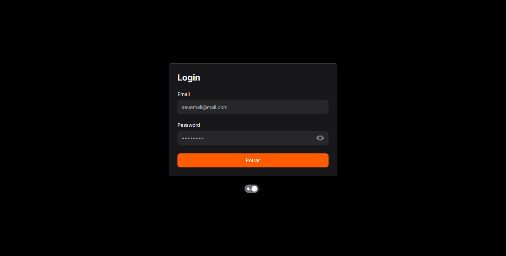
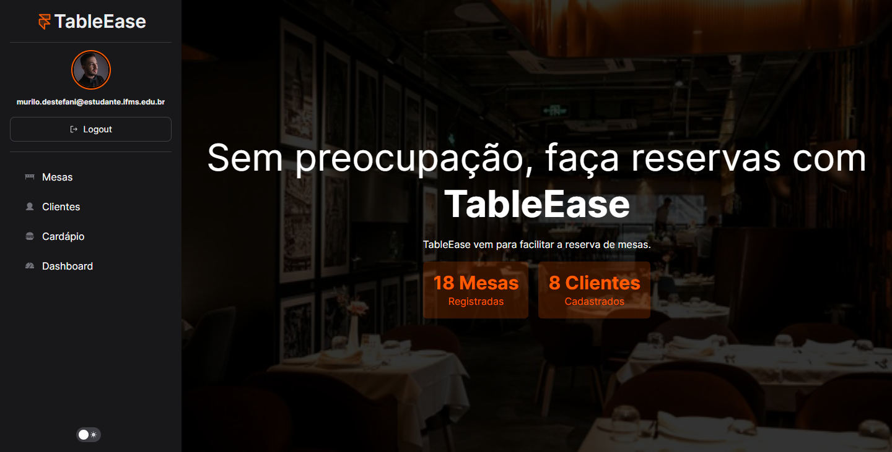
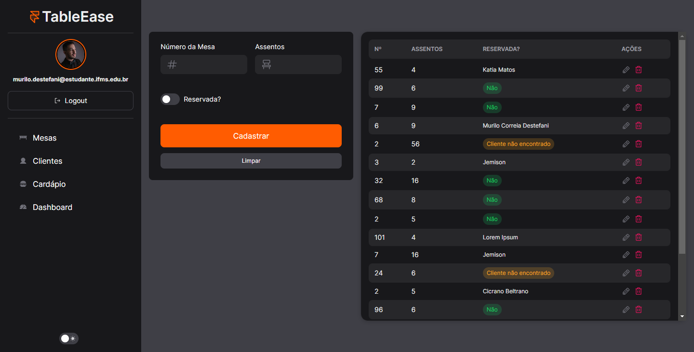
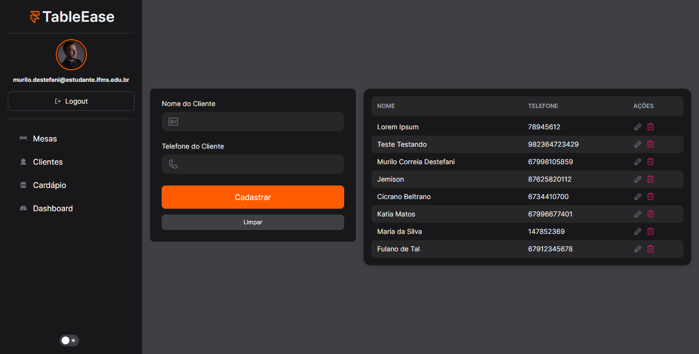
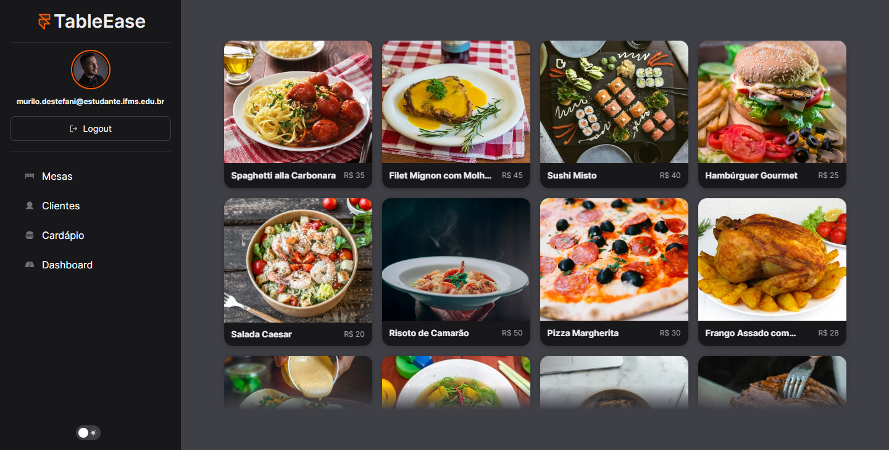
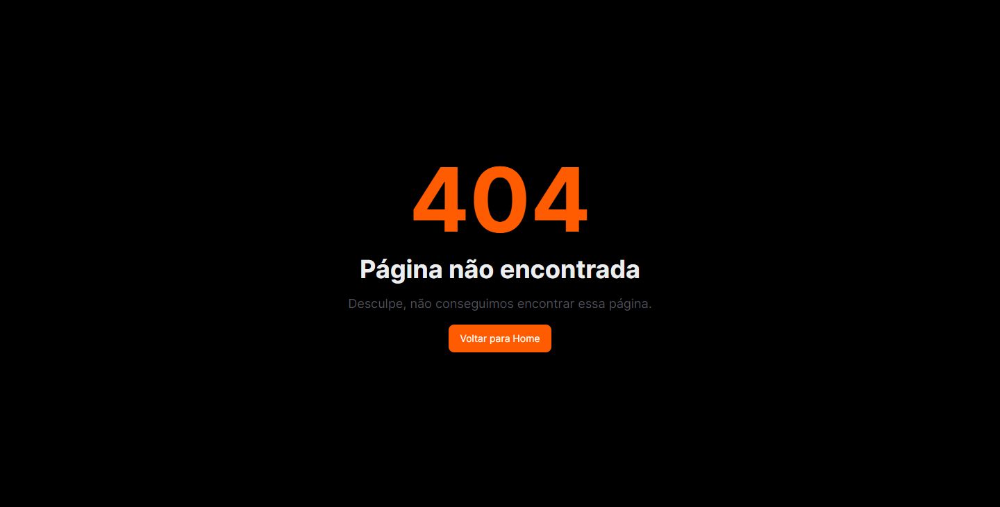

# <p style="text-align: center">Table Ease</p>


[](https://choosealicense.com/licenses/mit/)

<p>Este é um projeto de um Sistema de Reserva de Mesas desenvolvido como trabalho final para a disciplina de Frameworks 2. O sistema foi construído utilizando React e TypeScript, com o objetivo de proporcionar uma interface amigável e eficiente para a reserva de mesas em restaurantes.</p>


## 🖼️ Screenshots
<div style="text-align: center">






</div>


## 🚀 Stack utilizada

**Front-end:** React, Typescript, Next-UI, TailwindCSS.

**Back-end:** Node, Express


## 💫 Funcionalidades

- Gerenciamento de Reserva de Mesas
- Gerenciamento de Clientes
- Exibição de Cardápio
- Tema Dark e Light


## ⚙️ Instalação
Instale Table Management com **bun**

```bash
  git clone https://github.com/murilodestefani/table-management.git
```

Entre no diretório do projeto

```bash
  cd table-management
```

Instale o **bun**

```bash
  npm install -g bun
```

Instale as dependências

```bash
  bun i
```

Inicie o servidor

```bash
  bun dev
```

### 🪳 Rodando os testes

Para rodar os testes, rode o seguinte comando

```bash
  bun run test
```


## 💻 Autor
- [Murilo Destefani](https://github.com/murilodestefani)
